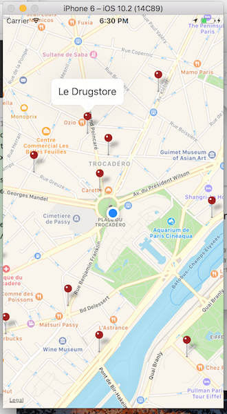

# Tabac ouvert ios App 🚬🤖

## Synopsis

first app to play around react-native.
I use the data from open gov.

The app works fine on the simulator but i'm having issues run it on my device.

## Issues

not compiling on real device
Error : __nw_connection_get_connected_socket_block_invoke Connection has no connected handler" error
